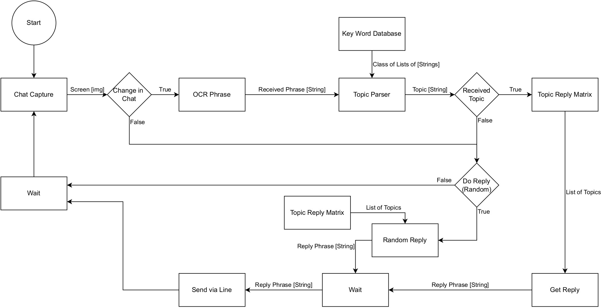

# AI Conversation System for Love-Bot
This system will listen to a Line conversation from the Hikari holographic robot and will reply approporiately. The system replies based on the gains and relationships from the ai-weight-matrix.  The overall blockdiagram for the system can be seen in the section "Block Diagram"

# Todo
* add response so it only replies x amount of times imediately

# Block Diagram

